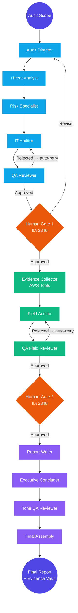

# 🎯 GRC Audit Swarm

> **AI Multi-Agent GRC Audit Platform powered by CrewAI & Groq**

GRC Audit Swarm is a stateful, three-phase audit automation platform that converts a plain-language scope into a fully documented audit report. It orchestrates specialized **CrewAI** agent crews across Planning, Fieldwork, and Reporting — each gated by a human approval step and backed by an immutable evidence vault.

> [!NOTE]
> **View the Complete Portfolio Case Study:** The architectural decisions and design rationale are documented in **[CASE_STUDY.md](CASE_STUDY.md)**.

---

## 🛠️ The Three-Phase Audit Workflow

### 🧠 Phase 1: Planning (The Brain)
Five sequential agents build and validate a Risk and Control Matrix (RACM):

- **Audit Director:** Consumes scope and business context; produces a 2-paragraph Audit Scope & Objective memo.
- **Regulatory & Threat Analyst:** Crosswalks the theme against selected frameworks (CIS, NIST, PCI-DSS, etc.) and identifies key threat vectors.
- **Risk & Threat Specialist:** Ranks and weights the top 3 risks from the threat analysis.
- **Senior IT Auditor:** Drafts the full RACM — every control must include Test of Design, Test of Effectiveness, and Substantive Testing steps.
- **QA Reviewer (temp=0):** Independently validates the RACM; rejects if substantive testing is missing or ToE relies only on inquiry. On rejection, the crew auto-retries once with the rejection reason injected as context.

Human approval is required before Phase 2 begins (IIA 2340 stamping).

### ⚙️ Phase 2: Fieldwork (The Engine)
Three agents execute live evidence collection and evaluate controls:

- **Evidence Collector:** Calls native AWS tools (`get_iam_password_policy`, `list_iam_users_with_mfa`, `list_public_s3_buckets`) to gather real evidence.
- **Field Auditor:** Evaluates each control against the collected evidence and produces a Working Paper with per-control severity ratings.
- **QA Field Reviewer (temp=0):** Validates finding consistency; rejects if Pass ratings lack supporting evidence. Auto-retries once on rejection.

All evidence is hashed and stored in the **Evidence Vault** (PCAOB AS 1215 / IIA 2330). The Phase 2 UI shows ✅/❌ vault quote verification badges per finding.

### 📝 Phase 3: Reporting (The Pen)
Four sequential tasks produce the final deliverable:

- **Lead Report Writer:** Synthesises Phase 1 scope and Phase 2 working papers into a structured audit report body.
- **Executive Concluder:** Drafts a concise executive summary from the report.
- **Tone & QA Reviewer (temp=0):** Rejects the report if language is subjective, inflammatory, or confusing.
- **Assembly (Lead Writer):** Packages both sections into the `FinalReportSchema` for download.

### 🔄 Architecture Flow



---

## 🚀 Key Features

- **🤖 CrewAI Multi-Agent Crews:** Three independent sequential crews (Planning, Fieldwork, Reporting), each with dedicated YAML-configured agents and a QA gate.
- **🔁 QA Auto-Retry Loop:** On rejection, the rejection reason is automatically injected as feedback and the crew re-runs once — no manual intervention needed.
- **🔐 Immutable Evidence Vault:** SHA-256 hashed evidence files (PCAOB AS 1215). `verify_exact_quote()` confirms agent quotes are verbatim from collected data, preventing hallucinations.
- **☁️ Live AWS Evidence Collection:** Native CrewAI tools call real AWS APIs (IAM password policy, MFA status, S3 bucket ACLs) during fieldwork.
- **💾 Persistent Sessions:** Full audit state serialized to `data/audit_sessions.json`. Sidebar shows session history with phase badges; any session is restorable.
- **📊 Phase 2 Findings Command Center:** KPI metrics (Pass / Deficiency / Material Weakness counts), expandable per-control drill-downs, and vault verification badges.
- **📥 Excel Exports:** Download RACM (with ToD/ToE/Substantive steps) and Working Papers directly from the review screens.
- **⚡ Token Budget Controls:** `max_rpm=1` per crew and explicit `context=` per task keep requests under Groq's 6,000 TPM free-tier cap.
- **🔄 Multi-LLM Fallback:** Priority order Groq → Gemini → OpenAI. Set whichever key you have — the factory binds automatically.
- **🛡️ DEMO_MODE:** Set `DEMO_MODE=1` in `.env` to bypass all crews with hardcoded schemas for UI development.

---

## 🏃 Quickstart

```bash
# 1. Clone
git clone https://github.com/tvobrachini/grc-audit-swarm
cd grc-audit-swarm

# 2. Environment setup
cp .env.example .env
# Add at least one LLM key: GROQ_API_KEY, GEMINI_API_KEY, or OPENAI_API_KEY
# Optionally add AWS_ACCESS_KEY_ID / AWS_SECRET_ACCESS_KEY for live evidence collection

# 3. Install dependencies
uv sync

# 4. Launch
uv run streamlit run app.py --server.port 8502
# App accessible at http://localhost:8502
```

**LLM provider priority** (set whichever key you have):

| Key | Model | Notes |
|-----|-------|-------|
| `GROQ_API_KEY` | `llama-3.3-70b-versatile` | Recommended — free tier, fast |
| `GEMINI_API_KEY` | `gemini-2.0-flash` | Free tier with daily quota |
| `OPENAI_API_KEY` | `gpt-4o-mini` | Paid |

---

## 🔬 Testing

```bash
# Full test suite
uv run pytest tests/ -v

# Headless end-to-end monitor (all 3 phases)
python run_monitor.py

# Phase 1 only
python run_monitor.py --phase1-only

# Skip live AWS calls
python run_monitor.py --skip-aws
```

The `run_monitor.py` script validates the full crew execution pipeline — timing, QA gate outcomes, vault file creation, and final status — without the Streamlit UI.

---

## 🧱 Project Structure

```
src/
  swarm/
    crews/          # PlanningCrew, FieldworkCrew, ReportingCrew
    config/         # YAML agent + task definitions per crew
    state/          # AuditState Pydantic schema
    tools/          # Native AWS CrewAI tools
    evidence.py     # EvidenceAssuranceProtocol (SHA-256 vault)
    audit_flow.py   # AuditFlow orchestrator (plain class, 3 methods)
    llm_factory.py  # Multi-provider LLM binding
    schema.py       # RiskControlMatrixSchema, WorkingPaperSchema, FinalReportSchema
    session_manager.py
  ui/
    components/     # sidebar, phase0_scope, phase1_review, phase2_review, phase3_report
app.py              # Streamlit entry point
run_monitor.py      # Headless E2E test runner
```

---

*Developed by TVobrachini. Open-source under CC BY-ND 4.0.*
