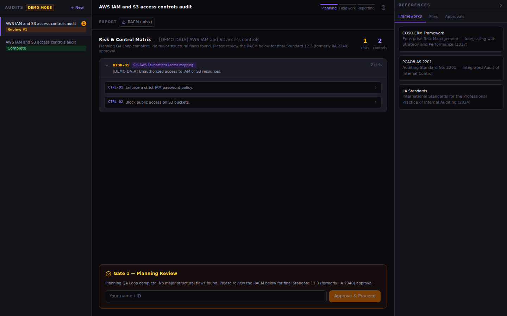
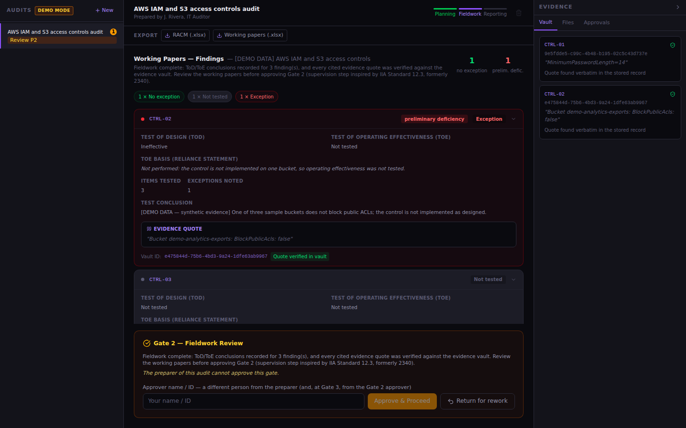
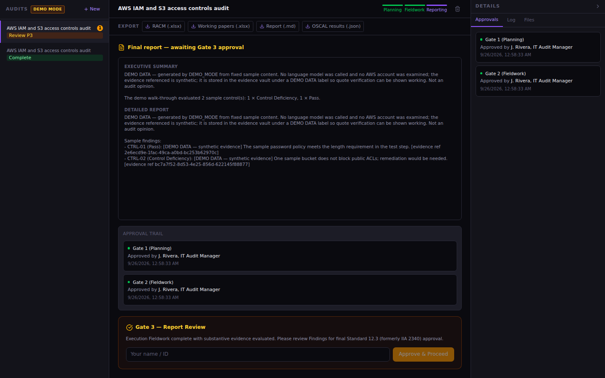
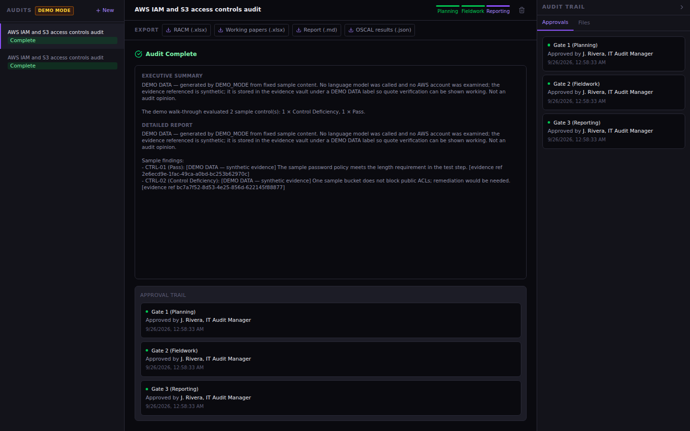
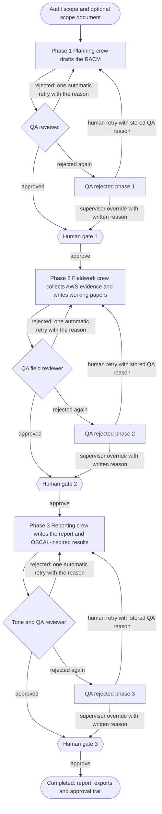

# GRC Audit Swarm

[](https://github.com/tvobrachini/grc-audit-swarm/actions/workflows/ci.yml)
[](LICENSE)
[](pyproject.toml)

An IT audit engagement has a shape: plan the risks and controls, test them against evidence, report the results, and have a supervisor review each step before the next one starts. GRC Audit Swarm is a personal project that drafts that work with language-model agents while keeping the audit structure in place. It takes a plain-language scope and produces a Risk and Control Matrix (RACM), working papers built from read-only AWS evidence, and a draft report. A person must approve each phase before the next one runs, and every approval, retry and override is written to an approval trail. The output is a draft for a qualified auditor to review, not an audit opinion.

> [!IMPORTANT]
> **Disclaimer:** This repository is an independent, personal open-source research and engineering project developed on personal time. It is not affiliated with, sponsored by or endorsed by any current or past employer.

Design notes: [CASE_STUDY.md](CASE_STUDY.md) (the audit reasoning behind the design) and [DECISIONS.md](DECISIONS.md) (architecture decision records).

---

## Try it in 2 minutes (no API keys)

`DEMO_MODE=1` makes the API replace the agent crews with fixed, clearly labelled demo artifacts. No language model or AWS account is called. The state machine, QA bookkeeping, human gates, approval trail and exports all run for real, and the UI shows a DEMO MODE badge.

**With Docker Compose**

```bash
git clone https://github.com/tvobrachini/grc-audit-swarm
cd grc-audit-swarm
cp .env.example .env
# In .env, set:
#   API_AUTH_TOKEN=<any long random string>
#   DEMO_MODE=1
docker compose up --build
```

Open http://localhost:3000. Compose binds both ports to `127.0.0.1` only. Sessions and evidence persist in the `app-data` Docker volume; `docker compose down -v` deletes them. nginx adds the API token to `/api` requests on the server side, so the browser never holds it.

**Without Docker (local development only)**

```bash
uv sync
# Terminal 1: the API
API_AUTH_TOKEN=dev-token DEMO_MODE=1 PYTHONPATH=src uv run uvicorn api.main:app --port 8000

# Terminal 2: the React dev server (proxies /api to port 8000)
cd frontend && npm ci && VITE_API_AUTH_TOKEN=dev-token npm run dev
```

Open http://localhost:5173. `VITE_API_AUTH_TOKEN` is built into the JavaScript bundle, so use it only for a throwaway local dev server. In this mode the live agent-activity feed returns 401, because the browser's `EventSource` cannot send an `Authorization` header. The audit status, gates and artifacts still refresh through polling. Use Compose for the full experience.

Optional demo settings: `DEMO_QA_REJECT_PHASE=1|2|3` makes the demo QA reviewer reject that phase until a person retries it, so the retry and override paths can be tried. `DEMO_STEP_DELAY` sets the pause between demo steps in seconds (default 0.4, capped at 5). Demo evidence is synthetic and is not written to the evidence vault, so demo findings show "Quote not verified".

To run a real audit, set one LLM provider (see [Configuration](#configuration)) and, for live evidence, AWS credentials with the read-only policy below. Leave `DEMO_MODE` unset.

---

## What it looks like

All screenshots below are from a `DEMO_MODE=1` run — the theme, findings and report text are fixed demo content, not language-model output, and no AWS account was examined. Every screen carries a visible DEMO MODE badge and labels demo findings as such.

<table>
<tr>
<td width="50%">



Gate 1 — the RACM drafted by planning, waiting for a human to approve it before fieldwork starts.

</td>
<td width="50%">



Gate 2 — findings from fieldwork, each with a badge showing whether its quoted evidence verifies against the evidence vault.

</td>
</tr>
<tr>
<td width="50%">



Gate 3 — the draft report, awaiting the final approval before issuance.

</td>
<td width="50%">



Completed audit: the full approval trail and the export buttons for the RACM, working papers, report and OSCAL results.

</td>
</tr>
</table>

There is also a screenshot of the [QA-rejection / retry / override](docs/screenshots/qa-rejection-retry-and-override.png) path, and the sample RACM, working papers, report and OSCAL exports these screenshots came from are in [docs/sample-run/](docs/sample-run/) (also demo data, with a note on what each file is). To regenerate any of this yourself, see [scripts/capture_screenshots.mjs](scripts/capture_screenshots.mjs).

---

## How it works

The workflow runs three CrewAI crews in sequence. Each crew ends with a QA reviewer agent, and each phase ends at a human gate.

| Phase | Agents | Output |
|---|---|---|
| 1. Planning | Audit Director, Regulatory & Threat Analyst, Risk & Threat Specialist, Senior IT Auditor, Quality & Pushback Reviewer | RACM: risks, controls, and for every control test-of-design, test-of-effectiveness and substantive steps |
| 2. Fieldwork | Field Evidence Collector (AWS tools), IT Field Auditor, Execution QA & Pushback Reviewer | Working papers: one finding per control, with severity, test conclusion, an exact evidence quote and a vault ID |
| 3. Reporting | Lead Report Writer, Chief Audit Executive (executive summary), Reporting Tone & QA Reviewer, Compliance Documentation Engineer; 5 tasks, the writer also assembles the final report | Report narrative, executive summary and an OSCAL-inspired results structure |

**What each phase receives.** The RACM drafter works from the Risk Specialist's ranked risk list. Fieldwork receives the approved RACM. Reporting receives the scope, a summary of the RACM (risks and controls) and the approved working papers. The OSCAL task receives a `control_id | severity | vault_id` index so it copies IDs instead of inventing them. `tests/test_prompt_inputs.py` checks that every placeholder in the crews' YAML prompts is filled by the inputs the flow passes.

**QA gates (automatic).** QA reviewers run at temperature 0. The other agents run at 0.1. If QA rejects the output, or its answer cannot be parsed, the phase counts as rejected: QA fails closed. The flow then re-runs the crew once with the rejection reason added to the drafting prompt. This happens in all three phases. A second rejection stops the phase in `QA_REJECTED_PHASE_n` and keeps the rejected draft for review. A crew error stops it in `ERROR_PHASE_n`.

**Human gates.** An explicit state machine (`src/swarm/state/machine.py`) decides which moves are allowed. Any other move raises `InvalidTransitionError`, which the API returns as HTTP 409 (for example, approving the same gate twice). At each gate a reviewer can:

- **Approve.** Gates 1 and 2 start the next phase. Gate 3 marks the audit `COMPLETED`.
- **Retry** a QA-rejected or failed phase. After a QA rejection, the stored rejection reason is passed back to the crew.
- **Approve despite the QA rejection** (supervisor override). This requires a written reason and does not skip anything: the phase moves to its normal human gate, which still has to be approved.

Each action is recorded in the approval trail with the gate, the reviewer's name as entered, a UTC timestamp, the action (`gate_approval`, `retry` or `qa_override`) and, where relevant, the override reason and the QA rejection it overrode.


```mermaid
flowchart TD
    scope(["Audit scope and optional scope document"]) --> p1

    p1["Phase 1 Planning crew drafts the RACM"] --> qa1{"QA reviewer"}
    qa1 -- "rejected: one automatic retry with the reason" --> p1
    qa1 -- "rejected again" --> r1["QA rejected phase 1"]
    qa1 -- "approved" --> g1{{"Human gate 1"}}
    r1 -- "human retry with stored QA reason" --> p1
    r1 -- "supervisor override with written reason" --> g1

    g1 -- "approve" --> p2["Phase 2 Fieldwork crew collects AWS evidence and writes working papers"]
    p2 --> qa2{"QA field reviewer"}
    qa2 -- "rejected: one automatic retry with the reason" --> p2
    qa2 -- "rejected again" --> r2["QA rejected phase 2"]
    qa2 -- "approved" --> g2{{"Human gate 2"}}
    r2 -- "human retry with stored QA reason" --> p2
    r2 -- "supervisor override with written reason" --> g2

    g2 -- "approve" --> p3["Phase 3 Reporting crew writes the report and OSCAL-inspired results"]
    p3 --> qa3{"Tone and QA reviewer"}
    qa3 -- "rejected: one automatic retry with the reason" --> p3
    qa3 -- "rejected again" --> r3["QA rejected phase 3"]
    qa3 -- "approved" --> g3{{"Human gate 3"}}
    r3 -- "human retry with stored QA reason" --> p3
    r3 -- "supervisor override with written reason" --> g3

    g3 -- "approve" --> done(["Completed: report, exports and approval trail"])
```

**Evidence.** The Field Evidence Collector calls three boto3-based tools: IAM password policy, IAM users with MFA status, and S3 buckets with a PUBLIC / NOT_PUBLIC / UNKNOWN verdict per bucket (from the bucket policy status, ACL grants, and account- and bucket-level Block Public Access). A read that is denied makes the verdict UNKNOWN rather than a guess. Each result has AWS account IDs redacted and is written to the evidence vault, and the agent receives a vault ID with the output. The field auditor must quote evidence exactly. The UI checks each quote against the vault and shows "Quote verified in vault" or "Quote not verified".

**Outputs.** The UI shows the RACM, a findings board with per-finding vault checks, the report and the approval trail. Four downloads are available once the artifact exists (`GET /api/sessions/{id}/export/...`): `racm.xlsx`, `working-papers.xlsx`, `report.md` and `oscal.json`. Spreadsheet cells are sanitised against formula injection.

**Scope documents.** A new audit can include a PDF or text scope document (up to 5 MB, 30 PDF pages and 20,000 extracted characters). The extracted text is wrapped in delimiters that label it as untrusted user-supplied content. This reduces prompt-injection risk but does not remove it. The human gates are the control that matters.

---

## What I built vs what CrewAI provides

| CrewAI provides | This project adds |
|---|---|
| Agent, task and crew abstractions; sequential execution; LLM calls; parsing task output into Pydantic models | The audit state machine, three human gates, retry and supervisor-override actions, and the approval trail |
| | Fail-closed QA gates and the automatic retry that feeds the rejection reason back, in every phase |
| | The evidence vault: account-ID redaction, SHA-256 or keyed HMAC digests, optional encryption, exact-quote verification, and a digest migration command |
| | Read-only AWS evidence tools (boto3) and the matching minimal IAM policy |
| | Audit schemas: RACM with design/effectiveness/substantive steps, working papers, and an OSCAL-inspired results model |
| | Prompt wiring between phases (ranked risks, RACM, working papers, findings index) and the tests that check it |
| | FastAPI backend, React UI, exports, scope-document handling and DEMO_MODE |
| | The test suite, CI, container setup and security tooling |

---

## Security and data handling

- **Read-only AWS access.** The tools call only read APIs, and the policy below is all they need. The agents' prompts also say not to change anything, but the IAM policy and the tool code are what enforce read-only access.
- **Redaction.** 12-digit numbers in AWS account-ID form (`123456789012` or `1234-5678-9012`) are replaced with `[REDACTED]` before evidence is stored and before tool output is returned to the agents. Any other standalone 12-digit number is redacted as well.
- **Evidence vault.** One JSON file per evidence record, with a SHA-256 digest. With `VAULT_ENCRYPTION_KEY` set, records are Fernet-encrypted and carry an HMAC-SHA256 digest keyed from that key. See [Limitations](#limitations-and-accuracy) for what this does not detect.
- **API token.** Every `/api/*` route requires `API_AUTH_TOKEN` (the API returns 503 if it is not set, and 401 for a wrong or missing token). `/health` is open. In Compose, nginx injects the token server-side.
- **Deployment defaults.** Compose publishes ports on `127.0.0.1` only. The API container runs as a non-root user. nginx sets a Content-Security-Policy and other hardening headers. The API refuses to start with `DEMO_MODE=1` when `ENVIRONMENT` is `production` or `staging`.
- **Untrusted input.** Scope documents are size-limited and wrapped as untrusted content (see above).

<details>
<summary>Minimal read-only AWS IAM policy</summary>

```json
{
  "Version": "2012-10-17",
  "Statement": [
    {
      "Sid": "GRCAuditSwarmReadOnlyEvidenceCollection",
      "Effect": "Allow",
      "Action": [
        "iam:GetAccountPasswordPolicy",
        "iam:ListUsers",
        "iam:ListMFADevices",
        "s3:ListAllMyBuckets",
        "s3:GetAccountPublicAccessBlock",
        "s3:GetBucketPublicAccessBlock",
        "s3:GetBucketPolicyStatus",
        "s3:GetBucketAcl"
      ],
      "Resource": "*"
    }
  ]
}
```

These map to the boto3 calls in `src/swarm/tools/aws_checks.py`: `iam.get_account_password_policy`, `iam.list_users`, `iam.list_mfa_devices`, `s3.list_buckets`, `s3control.get_public_access_block` (account-level Block Public Access), `s3.get_public_access_block`, `s3.get_bucket_policy_status` and `s3.get_bucket_acl`. The S3 check also calls `sts.get_caller_identity` to get the account ID for the S3 Control call; that call needs no IAM permission, and the account ID is not included in the output. If one of the S3 read permissions is missing, the affected buckets are reported as UNKNOWN (with the reason) rather than public or not public. The separate `aws_safety_heartbeat.py` script (a cost check for a lab account) also uses `sts:GetCallerIdentity`, `ec2:DescribeInstances` and `rds:DescribeDBInstances`, which the audit itself does not need.
</details>

To report a vulnerability, see [SECURITY.md](SECURITY.md).

---

## Configuration

Set these in `.env` or in the environment. Compose and `run_monitor.py` read `.env`; a bare `uvicorn` run does not, so export the variables there.

**LLM provider.** The factory (`src/swarm/llm_factory.py`) uses the first provider that is configured, in this order. If none is set, starting a crew raises a configuration error that lists these variables (DEMO_MODE does not need any).

| Order | Variable | Model used |
|---|---|---|
| 1 | `OLLAMA_MODEL` (plus optional `OLLAMA_BASE_URL`, default `http://localhost:11434`) | the local Ollama model you name |
| 2 | `NVIDIA_API_KEY` (plus optional `NVIDIA_BASE_URL`) | `meta/llama-3.3-70b-instruct` |
| 3 | `GEMINI_API_KEY` | `gemini-2.5-flash`, or `GEMINI_MODEL` if set |
| 4 | `OPENAI_API_KEY` | `gpt-4o-mini` |
| 5 | `GROQ_API_KEY` | `llama-3.3-70b-versatile` |

Gemini model names are retired regularly; set `GEMINI_MODEL` if the default stops working.

**Other settings**

| Variable | Purpose |
|---|---|
| `API_AUTH_TOKEN` | Shared bearer token for all `/api/*` routes. Required. |
| `VITE_API_AUTH_TOKEN` | Dev only: lets `npm run dev` send the token. It is built into the JS bundle, so never set it for a Compose or production build. |
| `CORS_ALLOWED_ORIGINS` | Comma-separated origin allow-list (default `http://localhost:5173`; `*` is ignored). |
| `DEMO_MODE` | `1` (or `true`, `yes`, `on`) replaces the crews with fixed demo artifacts. |
| `DEMO_QA_REJECT_PHASE` | `1`, `2` or `3`: in demo mode, QA rejects that phase until a person retries it. |
| `DEMO_STEP_DELAY` | Seconds between demo steps (default 0.4, range 0 to 5). |
| `ENVIRONMENT` | `production`/`prod`/`staging`/`stage` make the API refuse to start with `DEMO_MODE` on. |
| `VAULT_ENCRYPTION_KEY` | Base64-encoded 32-byte key. Turns on Fernet encryption and keyed digests in the vault. |
| `EVIDENCE_VAULT_PATH` | Vault directory (default `evidence_vault/` at the repo root; Compose uses `/app/data/evidence_vault` in the `app-data` volume). |
| `SESSIONS_PATH` | Session file (default `data/audit_sessions.json`). |
| `PHASE_EXECUTOR_MAX_WORKERS` | Worker threads for phase jobs in the API (default 10). |
| `AWS_ACCESS_KEY_ID`, `AWS_SECRET_ACCESS_KEY`, `AWS_DEFAULT_REGION` | Standard boto3 credentials for live evidence collection. Any boto3 credential source works. |

Generate a vault key:

```bash
python -c "import os, base64; print(base64.urlsafe_b64encode(os.urandom(32)).decode())"
```

If you enabled encryption before keyed digests were introduced, re-seal older encrypted records. The command exits non-zero if any record fails its integrity check, and it never re-seals a record whose payload no longer matches its stored hash.

```bash
PYTHONPATH=src uv run python -m swarm.evidence migrate-digests
```

---

## Testing and CI

```bash
uv sync
PYTHONPATH=. uv run pytest tests/ -q --cov=src   # unit and API tests with coverage
uv run pre-commit run --all-files                  # ruff, bandit, detect-secrets, pip-audit, hygiene
uv run pyright src/                                # type check
cd frontend && npm ci && npm run lint && npm run build

# Headless run of the real crews, without the API or UI (needs an LLM provider)
uv run python run_monitor.py                 # all three phases
uv run python run_monitor.py --phase1-only   # Planning only
uv run python run_monitor.py --skip-aws      # mock working papers instead of the Fieldwork crew
```

The tests use mocked crews, LLMs and AWS clients (MagicMock, botocore Stubber, and moto for the evaluation below). They cover the state machine and gates, QA fail-closed behaviour and retries, prompt wiring, the evidence vault and redaction, the AWS tools, the LLM factory, session persistence, and the API (gates, retry and override, exports, scope upload, DEMO_MODE). At the time of writing: 371 tests, 90% line coverage of `src/`.

### Evidence-layer evaluation

`tests/eval/` checks the deterministic evidence collection against planted misconfigurations. Each scenario seeds a fresh in-memory AWS account ([moto](https://github.com/getmoto/moto)) with a known configuration, runs the real CrewAI evidence tool, and checks three things: the evidence matches what was planted, the output contains no account ID, and the output is in the evidence vault with an exact quote that verifies.

```bash
PYTHONPATH=. uv run pytest tests/eval -v      # add -s to print the scenario scorecard
```

| Scenario | Expected evidence |
|---|---|
| No account password policy | Finding: no policy set |
| Weak policy (length 6, no symbols) / strong policy (length 14, all character types, rotation, reuse) | Policy values reported exactly |
| 60 IAM users, every third with a virtual MFA device | Yes / No per user |
| Private bucket; bucket policy granting only the owner account | NOT_PUBLIC |
| ACL grant to AllUsers (READ; READ and WRITE) | PUBLIC, with each grant as a reason |
| ACL grant to AuthenticatedUsers (any AWS account) | PUBLIC |
| Bucket policy with `Principal: "*"` | PUBLIC |
| Public policy, bucket-level RestrictPublicBuckets on | NOT_PUBLIC, with a note |
| Public ACL, account-level IgnorePublicAcls on | NOT_PUBLIC, with a note |
| Public ACL, all four bucket-level BPA flags on | NOT_PUBLIC |
| Public ACL, only BlockPublicAcls on (blocks new ACLs, not existing ones) | PUBLIC |
| Partial bucket-level BPA, nothing public | NOT_PUBLIC (the old check flagged this) |
| Account ID inside a bucket name | Redacted in output and vault |

moto does not implement everything faithfully. `GetBucketPolicyStatus` returns no `IsPublic` value, moto accepts public ACLs and policies that Block Public Access would reject, it returns only one grant for the `public-read-write` canned ACL, and it does not paginate `ListUsers`. The test module lists how each gap is handled, and `tests/test_aws_checks.py` covers those branches (policy status, access denied on each read, pagination markers) with botocore Stubber against the real AWS API models. For policy scenarios, the scenario states the `IsPublic` value AWS returns for the planted policy, so those rows test how the tool combines that value with the ACL and Block Public Access, not AWS's policy evaluation.

This does not evaluate the LLM agents: whether they draw the right conclusion from the evidence, and the quality of the working papers and report, are still unmeasured.

CI (`.github/workflows/ci.yml`) runs on every push and pull request to `master`:

- pre-commit hooks (ruff lint and format, bandit, detect-secrets, pip-audit, file hygiene);
- pyright on `src/`;
- pytest on Python 3.11, 3.12 and 3.13, failing below 50% coverage;
- bandit, and pip-audit against the exported `uv.lock` requirements (the ignored advisories are listed and explained in the workflow);
- frontend lint, build and `npm audit --audit-level=high`;
- Docker builds for both images and `docker compose config`. The API image runs Python 3.13, the newest version the test matrix covers.

All GitHub Actions are pinned to commit SHAs. A dependency-review workflow runs on pull requests, and Dependabot tracks uv, npm, GitHub Actions and both Dockerfiles. Python 3.14 is not supported yet: crewai pins `chromadb~=1.1.0`, and chromadb 1.1.x fails to import on 3.14, so Dependabot is told not to propose it.

---

## Project structure

```
src/
  swarm/
    audit_flow.py        # AuditFlow: runs the phases, QA retry, gates, approval trail
    state/
      machine.py         # AuditStateMachine: allowed transitions, InvalidTransitionError
      schema.py          # AuditState
      repository.py      # Save / load a flow with its artifacts
    crews/               # PlanningCrew, FieldworkCrew, ReportingCrew, result adapter
    config/              # YAML agent and task prompts per crew; MCP server config
    tools/aws_tools.py   # Read-only boto3 evidence tools
    evidence.py          # Evidence vault, redaction, quote check, migrate-digests
    schema.py            # RACM, working paper, final report and OSCAL-inspired models
    demo.py              # DEMO_MODE stand-in crews and labelled demo artifacts
    llm_factory.py       # LLM provider selection
    mcp_server.py        # Standalone MCP server exposing the AWS reads (no redaction or vault)
    session_manager.py   # Session file persistence
    skill_loader.py      # Loads domain skill prompts from skills/
  api/
    main.py              # FastAPI app, auth, CORS, upload size limit
    auth.py              # Bearer-token check
    routers/             # sessions (gates, retry, override), exports, phases (jobs, stream), evidence, config
    exports.py           # xlsx / Markdown / OSCAL JSON builders with formula-injection sanitising
    scope_document.py    # PDF and text scope-document extraction and wrapping
frontend/                # React + Vite UI, served by nginx in Compose (nginx.conf.template)
skills/                  # Domain skill prompts (AWS, ITGC, PCI DSS, HIPAA, GDPR)
tests/                   # pytest suite
run_monitor.py           # Headless run of all three crews
aws_safety_heartbeat.py  # Checks a lab AWS account for running EC2 / RDS resources
Dockerfile, docker-compose.yml
```

---

## Limitations and accuracy

- **Decision support only.** The output is a draft for a qualified auditor. It is not an audit opinion and does not replace engagement supervision.
- **Not benchmarked.** There are no measured accuracy, precision, time-saving or cost figures.
- **QA is another LLM.** Temperature 0 lowers variance on hosted models but does not remove it. A QA approval does not show the output is correct.
- **Reviewer identity is self-declared.** The API uses one shared token. The name in the approval trail is what the reviewer typed, not an authenticated identity.
- **Evidence vault.** Each record's digest is stored in the same writable JSON file as the payload. Without encryption the digest detects accidental corruption only. With encryption, editing a record without the key is detected, but deleting a record or replacing it with an unencrypted one is not. The vault does not prove the absence of tampering. A verified quote shows the words are in the evidence; it does not show the conclusion drawn from them is right. Matching is exact, so paraphrases show as not verified.
- **AWS coverage.** Live collection covers the IAM account password policy, IAM user MFA, and S3 bucket public access. The Fieldwork crew has no other evidence tools, so controls outside these reads have no collected evidence behind them. Within them:
  - The S3 verdict combines the bucket policy status, bucket ACL grants to `AllUsers` / `AuthenticatedUsers`, and account- and bucket-level Block Public Access. Whether a policy is public is AWS's own evaluation (`GetBucketPolicyStatus`); the tool does not parse policies. It does not cover S3 access points (or their policies), Multi-Region Access Points, object-level ACLs, or presigned URLs. A policy that grants access to specific other AWS accounts is not "public" in AWS's sense, so cross-account sharing is not flagged. Per-bucket reads use one S3 client and rely on botocore's automatic region redirect for buckets in other regions; this is tested with stubs and moto only, not against a live multi-region account.
  - The MFA check lists IAM users only. The account root user is not returned by `iam:ListUsers`, so root MFA is not covered. It reports whether any MFA device is assigned, for every user, and does not check whether the user has console access.
  - The password-policy evidence is the policy as returned. "No policy set" is reported as a finding; judging whether a policy is strong enough is left to the auditor and the agents.
- **Standalone MCP server.** `src/swarm/mcp_server.py` uses the same evidence logic as the CrewAI tools, but it does not register evidence in the vault or redact its final output (AWS error messages are redacted).
- **OSCAL.** The results model is OSCAL-inspired, uses Python-style field names and is not validated against the official NIST OSCAL schema.
- **Demo data.** DEMO_MODE output is fixed sample content, labelled as demo data in every artifact. It is not evidence and not a finding about any system.
- **Standards.** References to IIA Global Internal Audit Standards 12.3 (formerly 2340) and 14.6 (formerly 2330), PCAOB AS 1215 and NIST OSCAL are design inspiration. The project makes no compliance claim against any of them.

---

## License and attribution

Developed by **Tiago Brachini**. The code in this repository is released under the [MIT License](LICENSE).

Control IDs refer to the Secure Controls Framework (SCF), © SCF Council, licensed under CC BY-ND 4.0. This repository maps to SCF control IDs only. It does not include or redistribute SCF data files (they are git-ignored), and the MIT License does not cover SCF content. Other frameworks referenced here (CIS Benchmarks, NIST SP 800-53, PCI-DSS) belong to their respective owners.
