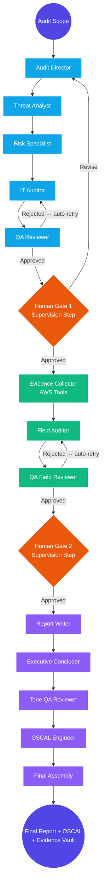

# 🎯 GRC Audit Swarm

> **AI Multi-Agent GRC Audit Platform powered by CrewAI**

GRC Audit Swarm is a stateful, three-phase audit automation platform that converts a plain-language scope into a fully documented audit report. It orchestrates specialized **CrewAI** agent crews across Planning, Fieldwork, and Reporting — each gated by a human approval step and backed by an hashed evidence vault.

> [!IMPORTANT]
> **Disclaimer:** This repository is an independent, personal open-source research and engineering project developed on personal time. It is not affiliated with, sponsored by or endorsed by any current or past employer.

> [!NOTE]
> **Architecture & Design Records:** See **[DECISIONS.md](DECISIONS.md)** for Architecture Decision Records (ADRs) and **[CASE_STUDY.md](CASE_STUDY.md)** for in-depth design rationale.

---

## 🛠️ The Three-Phase Audit Workflow

### 🧠 Phase 1: Planning (The Brain)
Five sequential agents build and validate a Risk and Control Matrix (RACM):

- **Audit Director:** Consumes scope and business context; produces a 2-paragraph Audit Scope & Objective memo.
- **Regulatory & Threat Analyst:** Crosswalks the theme against selected frameworks (CIS, NIST, PCI-DSS, etc.) and identifies key threat vectors.
- **Risk & Threat Specialist:** Ranks and weights the top 3 risks from the threat analysis.
- **Senior IT Auditor:** Drafts the full RACM — every control must include Test of Design, Test of Effectiveness, and Substantive Testing steps.
- **QA Reviewer (temp=0):** Independently validates the RACM; rejects if substantive testing is missing or ToE relies only on inquiry. On rejection, the crew auto-retries once with the rejection reason injected as context.

Human approval is required before Phase 2 begins (an engagement-supervision step inspired by IIA Standard 2340, which requires engagements to be properly supervised — not a claim of literal 2340 compliance).

### ⚙️ Phase 2: Fieldwork (The Engine)
Three agents execute live evidence collection and evaluate controls:

- **Evidence Collector:** Calls native AWS tools via **boto3** (`get_iam_password_policy`, `list_iam_users_with_mfa`, `list_public_s3_buckets`) — no AWS CLI required.
- **Field Auditor:** Evaluates each control against the collected evidence and produces a Working Paper with per-control severity ratings.
- **QA Field Reviewer (temp=0):** Validates finding consistency; rejects if Pass ratings lack supporting evidence. Auto-retries once on rejection.

All evidence is hashed and stored in the **Evidence Vault**, following documentation-integrity principles drawn from PCAOB AS 1215 and IIA Standard 2330 (neither of which mandates a specific technical mechanism such as hashing — this is an engineering choice in their spirit, not a compliance claim; AS 1215 itself governs public-company financial-statement audits, a scope this general-purpose tool doesn't sit within). The Phase 2 UI shows ✅/❌ vault quote verification badges per finding.

### 📝 Phase 3: Reporting (The Pen)
Five sequential tasks across four agents produce the final deliverable:

- **Lead Report Writer:** Synthesises Phase 1 scope and Phase 2 working papers into a structured audit report body.
- **Executive Concluder:** Drafts a concise executive summary from the report.
- **Tone & QA Reviewer (temp=0):** Rejects the report if language is subjective, inflammatory, or confusing.
- **Compliance Documentation Engineer:** Translates the narrative findings and evidence into a machine-readable NIST OSCAL format (`OSCAL_SAR_Schema`) for automated GRC platform ingestion.
- **Assembly (Lead Writer):** Packages all sections (narrative, executive, and OSCAL) into the `FinalReportSchema` for download.

### 🔄 Architecture Flow


```mermaid
graph TD
    classDef init fill:#4f46e5,color:#fff,stroke:#fff
    classDef human fill:#ea580c,color:#fff,stroke:#fff
    classDef phase1 fill:#0ea5e9,color:#fff,stroke:#fff
    classDef phase2 fill:#10b981,color:#fff,stroke:#fff
    classDef phase3 fill:#8b5cf6,color:#fff,stroke:#fff

    Start((Audit Scope)):::init --> Dir[Audit Director]:::phase1
    Dir --> Ana[Threat Analyst]:::phase1
    Ana --> Spec[Risk Specialist]:::phase1
    Spec --> Aud[IT Auditor]:::phase1
    Aud --> QA1[QA Reviewer]:::phase1
    QA1 -- Rejected → auto-retry --> Aud
    QA1 -- Approved --> HR1{Human Gate 1\nSupervision Step}:::human

    HR1 -- Revise --> Dir
    HR1 -- Approved --> Col[Evidence Collector\nAWS Tools]:::phase2
    Col --> FA[Field Auditor]:::phase2
    FA --> QA2[QA Field Reviewer]:::phase2
    QA2 -- Rejected → auto-retry --> FA
    QA2 -- Approved --> HR2{Human Gate 2\nSupervision Step}:::human

    HR2 -- Approved --> Wr[Report Writer]:::phase3
    Wr --> Ex[Executive Concluder]:::phase3
    Ex --> QA3[Tone QA Reviewer]:::phase3
    QA3 --> Osc[OSCAL Engineer]:::phase3
    Osc --> Asm[Final Assembly]:::phase3
    Asm --> End((Final Report + OSCAL\n+ Evidence Vault)):::init
```

---

## 🚀 Key Features

- **🤖 CrewAI Multi-Agent Crews:** Three independent sequential crews (Planning, Fieldwork, Reporting), each with dedicated YAML-configured agents and a QA gate.
- **🔁 QA Auto-Retry Loop:** On rejection, the rejection reason is automatically injected as feedback and the crew re-runs once — no manual intervention needed.
- **🔐 Hashed Evidence Vault:** SHA-256 hashed evidence files, in the spirit of PCAOB AS 1215's documentation-integrity principles (not a compliance claim — the standard doesn't mandate hashing). `verify_exact_quote()` confirms agent quotes are verbatim from collected data and match the stored hash, flagging quotes that are not found in the collected evidence. Optional Fernet at-rest encryption via `VAULT_ENCRYPTION_KEY`.
- **☁️ Live AWS Evidence Collection:** boto3-based tools call real AWS APIs directly (`get_iam_password_policy`, `list_iam_users_with_mfa`, `list_public_s3_buckets`) — no AWS CLI installation required. Requires only minimal read-only IAM permissions.

<details>
<summary>📋 View Minimal Read-Only AWS IAM Policy</summary>

```json
{
  "Version": "2012-10-17",
  "Statement": [
    {
      "Sid": "GRCAuditSwarmReadOnlyEvidenceCollection",
      "Effect": "Allow",
      "Action": [
        "iam:GetAccountPasswordPolicy",
        "iam:ListUsers",
        "iam:ListMFADevices",
        "s3:ListAllMyBuckets",
        "s3:GetBucketPublicAccessBlock",
        "s3:GetBucketAcl"
      ],
      "Resource": "*"
    }
  ]
}
```
</details>

- **🛡️ AWS Account ID Redaction:** 12-digit AWS account IDs are automatically scrubbed from all evidence before storage and before being returned to agents.
- **💾 Persistent Sessions:** Full audit state serialized to `data/audit_sessions.json`. Sidebar shows session history with phase badges; any session is restorable.
- **📊 Phase 2 Findings Command Center:** KPI metrics (Pass / Deficiency / Material Weakness counts), expandable per-control drill-downs, and vault verification badges.
- **📥 Excel Exports:** Download RACM (with ToD/ToE/Substantive steps) and Working Papers directly from the review screens.
- **🔄 Multi-LLM Support:** Priority order Ollama → NVIDIA → Gemini → OpenAI → Groq. Set whichever key you have — the factory binds automatically.
- **🛡️ DEMO_MODE:** Set `DEMO_MODE=1` in `.env` to bypass all crews with hardcoded schemas for UI development.

---

## 🏃 Quickstart

```bash
# 1. Clone
git clone https://github.com/tvobrachini/grc-audit-swarm
cd grc-audit-swarm

# 2. Environment setup
cp .env.example .env
# Add at least one LLM key: GEMINI_API_KEY, OPENAI_API_KEY, or GROQ_API_KEY
# Optionally add AWS credentials for live evidence collection

# 3. Install dependencies
uv sync

# 4. Launch (Full Stack)
# Starts FastAPI backend, React frontend, and Streamlit app
docker-compose up --build

# Alternatively, launch just the Streamlit interface:
uv run streamlit run app.py --server.port 8502
# App accessible at http://localhost:8502
```

**LLM provider priority** (the factory dynamically binds based on available keys/vars):

| Priority | Key | Model | Notes |
|----------|-----|-------|-------|
| 1 | `OLLAMA_MODEL` | (Local) e.g., `llama3` | Fully private, zero-cost local inference |
| 2 | `NVIDIA_API_KEY` | `llama-3.3-70b-instruct`| NVIDIA NIM infrastructure |
| 3 | `GEMINI_API_KEY` | `gemini-2.0-flash` | Recommended cloud tier — highly capable |
| 4 | `OPENAI_API_KEY` | `gpt-4o-mini` | Standard cloud fallback |
| 5 | `GROQ_API_KEY` | `llama-3.3-70b-versatile` | Fast inference, strict rate limits |

**Optional environment variables:**

| Variable | Purpose |
|----------|---------|
| `EVIDENCE_VAULT_PATH` | Override vault storage directory (useful for Docker volume mounts) |
| `SESSIONS_PATH` | Override session file path |
| `VAULT_ENCRYPTION_KEY` | Base64-encoded 32-byte key for Fernet at-rest vault encryption |
| `API_AUTH_TOKEN` | Shared bearer token required by the FastAPI `/api/*` routes |
| `VITE_API_AUTH_TOKEN` | Frontend build-time token used to call the protected API in single-user deployments |
| `DEMO_MODE` | Set to `1` to bypass LLM crews for UI development |
| `ENVIRONMENT` | Set to `production` or `staging` to enforce DEMO_MODE guard |

Generate a vault encryption key:
```bash
python -c "import os, base64; print(base64.urlsafe_b64encode(os.urandom(32)).decode())"
```

---

## 🔬 Testing

```bash
# Full test suite with coverage
uv run pytest tests/ -v --cov=src --cov-report=term-missing

# Headless end-to-end monitor (all 3 phases)
python run_monitor.py

# Phase 1 only
python run_monitor.py --phase1-only

# Skip live AWS calls
python run_monitor.py --skip-aws
```

The test suite covers evidence integrity, AWS tool mocking, LLM factory priority, audit flow QA retry loops, skill loading, and Streamlit UI components. CI enforces a 55% coverage minimum across Python 3.11, 3.12, and 3.13.

The `run_monitor.py` script validates the full crew execution pipeline — timing, QA gate outcomes, vault file creation, and final status — without the Streamlit UI.

---

## 🧱 Project Structure

```
src/
  swarm/
    crews/              # PlanningCrew, FieldworkCrew, ReportingCrew
    config/             # YAML agent + task definitions per crew
    state/              # AuditState Pydantic schema
    tools/
      aws_tools.py      # boto3-based AWS evidence collection tools
    evidence.py         # EvidenceAssuranceProtocol — SHA-256 vault + optional encryption
    audit_flow.py       # AuditFlow orchestrator (plain class, 3 methods)
    llm_factory.py      # Multi-provider LLM binding (Ollama → NVIDIA → Gemini → OpenAI → Groq)
    mcp_server.py       # FastMCP server exposing AWS tools for MCP clients
    schema.py           # RiskControlMatrixSchema, WorkingPaperSchema, FinalReportSchema
    session_manager.py  # Persistent audit session serialization
    skill_loader.py     # Dynamic CrewAI skill registration
  api/
    main.py             # FastAPI backend for headless/React consumption
  ui/
    components/         # Streamlit UI components
frontend/               # React + Vite modern web interface
skills/                 # YAML definitions for domain-specific audit skills (GDPR, HIPAA, etc.)
app.py                  # Streamlit entry point
aws_safety_heartbeat.py # Standalone boto3 script to verify $0 AWS resource usage
run_monitor.py          # Headless E2E test runner
docker-compose.yml      # Orchestrates API, Frontend, and Streamlit services
```

---

## ⚠️ Limitations & Accuracy

- **Decision support only:** the tool assists audit professionals. It is not a replacement for a qualified auditor or for engagement supervision.
- **Evidence vault:** each evidence payload is stored with its SHA-256 hash in the same local JSON file, and the UI checks that quotes cited by the field auditor appear verbatim in it. The hash detects accidental corruption. It does not prevent tampering with the files, and a verbatim quote does not prove the conclusion drawn from it.
- **AWS coverage:** live collection covers the IAM account password policy, IAM user MFA, S3 public access block settings and bucket ACLs. Other domains use simulated data or document ingestion.
- **Standalone MCP server:** `src/swarm/mcp_server.py` returns raw results. It does not redact account IDs or register evidence in the vault. Those apply on the CrewAI tool path.
- **QA agents:** QA reviewers run at `temperature=0`. That lowers variance on hosted models but does not remove it. A failed review triggers one automatic retry.
- **OSCAL export:** an OSCAL-inspired data model. It is not validated against the official OSCAL schema.
- **No measured accuracy:** this project has not been benchmarked. There are no measured precision, time or cost figures yet.

---

## 📄 License & Attribution

Developed by **Tiago Brachini**. The code in this repository is released under the **[MIT License](LICENSE)**.

Control IDs refer to the Secure Controls Framework (SCF), © SCF Council, licensed under CC BY-ND 4.0. This repository maps to SCF control IDs only. It does not include or redistribute SCF data files (they are git-ignored), and the MIT License does not cover SCF content. Other frameworks referenced here (CIS Benchmarks, NIST SP 800-53, PCI-DSS) belong to their respective owners.
