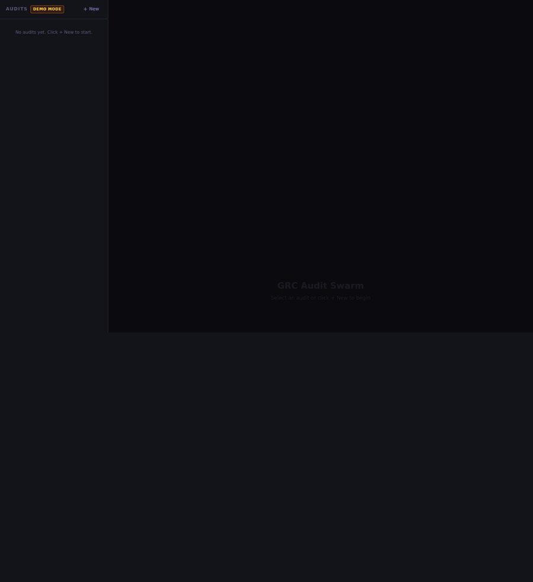
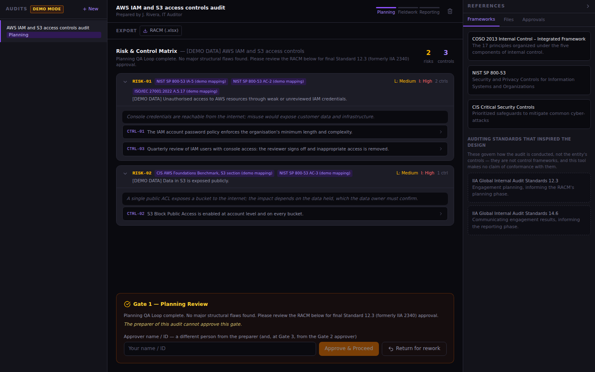
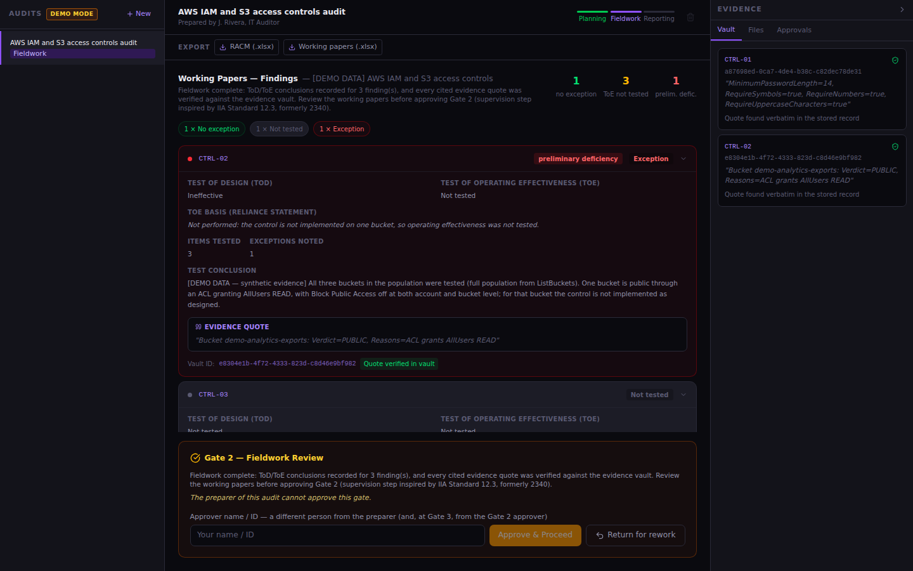
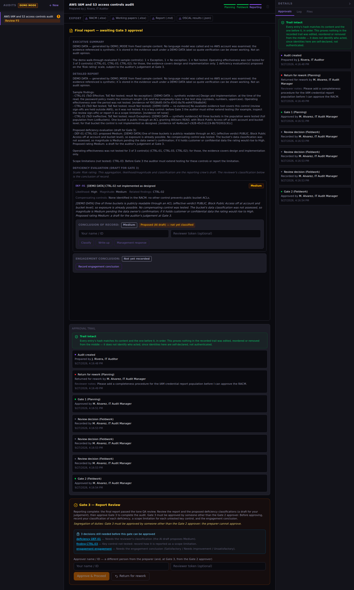
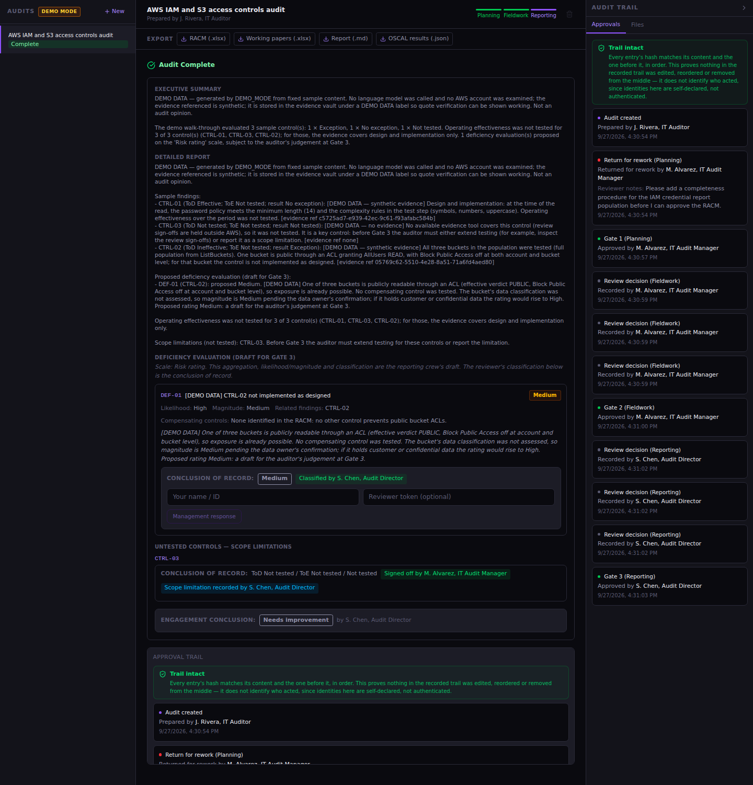

# GRC Audit Swarm

[](https://github.com/tvobrachini/grc-audit-swarm/actions/workflows/ci.yml)
[](LICENSE)
[](pyproject.toml)

Give it a scope such as "AWS IAM and S3 access controls": it drafts the RACM, tests the controls against read-only AWS evidence, and drafts the report — a named reviewer approves, returns or overrides each phase, and every action is recorded in a hash-chained trail.

> [!IMPORTANT]
> **Disclaimer:** This repository is an independent, personal open-source research and engineering project developed on personal time. It is not affiliated with, sponsored by or endorsed by any current or past employer.



The GIF above is a `DEMO_MODE=1` walk-through: a preparer starts an audit, Gate 1 is returned for rework with reviewer notes and then approved, Gate 2 shows a fieldwork finding with its evidence quote verified against the vault, Gate 3 shows the draft deficiency evaluation awaiting the auditor's judgement, and the completed audit shows an intact approval trail and the export buttons. All content in it is fixed demo data, not language-model output.

---

## Why this exists

An IT audit engagement has a shape: plan the risks and controls, test them against evidence, report the results, and have a supervisor review each step before the next one starts. That shape exists because none of preparer, evidence or model is trusted unsupervised — the same reason applies whether the preparer is a staff auditor or a language model. This project drafts the planning, fieldwork and reporting work with LLM agents while keeping that structure: a human still approves, returns or overrides every phase, and evidence still has to trace back to something read from the actual environment, not just asserted. It exists to test whether that structure is enough to make LLM-drafted audit work reviewable rather than to replace the reviewer.

---

## Try it in 2 minutes (no API keys)

`DEMO_MODE=1` makes the API replace the agent crews with fixed, clearly labeled demo artifacts. No language model or AWS account is called. The state machine, QA bookkeeping, human gates, approval trail and exports all run for real, and the UI shows a DEMO MODE badge.

**With Docker Compose**

```bash
git clone https://github.com/tvobrachini/grc-audit-swarm
cd grc-audit-swarm
cp .env.example .env
# In .env, set:
#   API_AUTH_TOKEN=<any long random string>
#   DEMO_MODE=1
docker compose up --build
```

Open http://localhost:3000. Compose binds both ports to `127.0.0.1` only. Sessions and evidence persist in the `app-data` Docker volume; `docker compose down -v` deletes them. nginx adds the API token to `/api` requests on the server side, so the browser never holds it.

**Without Docker (local development only)**

```bash
uv sync
# Terminal 1: the API
API_AUTH_TOKEN=dev-token DEMO_MODE=1 PYTHONPATH=src uv run uvicorn api.main:app --port 8000

# Terminal 2: the React dev server (proxies /api to port 8000)
cd frontend && npm ci && VITE_API_AUTH_TOKEN=dev-token npm run dev
```

Open http://localhost:5173. In this mode the live agent-activity feed returns 401 (the browser's `EventSource` cannot send an `Authorization` header); the audit status, gates and artifacts still refresh through polling. Use Compose for the full experience.

Optional demo settings: `DEMO_QA_REJECT_PHASE=1|2|3` makes the demo QA reviewer reject that phase until a person retries it, so the retry and override paths can be tried. `DEMO_STEP_DELAY` sets the pause between demo steps in seconds (default 0.4, capped at 5).

To run a real audit, set one LLM provider (see [Configuration](docs/CONFIGURATION.md)) and, for live evidence, AWS credentials with the read-only policy in [Security and data handling](docs/SECURITY-AND-DATA.md). Leave `DEMO_MODE` unset.

---

## What it does

Three CrewAI crews run in sequence — **Planning** drafts a Risk and Control Matrix (RACM), **Fieldwork** tests those controls against read-only AWS evidence and writes working papers, **Reporting** writes the draft report and deficiency evaluation. Each crew ends with an automatic QA reviewer that fails closed and gets one retry with its rejection reason, then each phase stops at a **human gate**, where a named reviewer can **approve** (starts the next phase), **return for rework** with required notes, or **approve despite a QA rejection** with a written override reason. The preparer of an audit cannot approve, return or override its own gates, and the Gate 3 approver must differ from the Gate 2 approver (segregation of duties, by declared name, or by per-reviewer token if configured — see [Limitations](docs/LIMITATIONS.md)).

At Gates 2 and 3 the reviewer records their own decisions beside the AI draft (sign-off or challenge per finding, a scope limitation for untested key controls, a classification and five-part write-up per deficiency, management's response, and an engagement conclusion); the gate will not open until the required ones exist, and exports show the reviewer's **conclusion of record** next to the AI draft where they differ ([ADR-011](DECISIONS.md)).

Besides its own read-only AWS reads, Fieldwork can import Prowler JSON exports and AWS Security Hub findings as point-in-time evidence ([docs/INTEGRATIONS.md](docs/INTEGRATIONS.md)).

Every finding's quoted evidence is checked in code, not by a model, against a redacted evidence vault, and shown in the UI as verified or not. Every gate action is appended to a hash-chained approval trail, along with which model, prompt version and run produced the artifact under review. Exports include a real, schema-validated **OSCAL 1.2.1 Assessment Results** document alongside RACM/working-papers spreadsheets and the Markdown report.

Full phase/agent breakdown, the state-machine diagram, generation provenance and the OSCAL export details: [docs/ARCHITECTURE.md](docs/ARCHITECTURE.md).

---

## Evaluation and results

Two layers, evaluated separately. The **evidence layer** (`tests/eval/`, runs in CI) plants known misconfigurations in a simulated AWS account (moto) and checks the deterministic AWS-reading tools against them — this part is measured and passes today. The **LLM layer** (`evals/`) runs 13 scenarios through the real pipeline against your own LLM provider and scores the agents' conclusions against a versioned answer key on false-pass rate, false-fail rate, citation faithfulness, deficiency-classification agreement and more.

**No real-model results are published yet.** The answer key is an AI-assisted draft that still awaits the owner's review, and the runner prints that status at the top of every report. Metric definitions, all 13 scenarios, cost and the harness's own limitations: [docs/EVALUATION.md](docs/EVALUATION.md).

---

## Screenshots

All from a `DEMO_MODE=1` run — the findings and report text are fixed demo content, not language-model output, and no AWS account was examined.

<table>
<tr>
<td width="50%">



Gate 1 — the RACM drafted by planning, waiting for a human to approve it before fieldwork starts.

</td>
<td width="50%">



Gate 2 — findings from fieldwork, each with a badge showing whether its quoted evidence verifies against the evidence vault.

</td>
</tr>
<tr>
<td width="50%">



Gate 3 — the draft report, awaiting the final approval before issuance.

</td>
<td width="50%">



Completed audit: the full approval trail and the export buttons for the RACM, working papers, report and OSCAL results.

</td>
</tr>
</table>

More screenshots (QA rejection / retry / override, control attributes, return-for-rework) and the sample RACM, working papers, report and OSCAL exports they came from: [docs/sample-run/](docs/sample-run/).

---

## Limitations

- **Decision support only.** The output is a draft for a qualified auditor, not an audit opinion, and does not replace engagement supervision.
- **Not benchmarked yet.** No measured accuracy, precision, time-saving or cost figures exist for the LLM layer; the harness is built, the answer key is not yet reviewed.
- **QA is another LLM,** run at temperature 0 to reduce (not remove) variance. A QA approval does not show the output is correct.
- **Reviewer identity is self-declared by default,** compared as typed names against one shared API token. Optional per-reviewer tokens (`REVIEWER_TOKENS_FILE`) tie each action to an issued token instead; that is not SSO and has no MFA — see [Security and data handling](docs/SECURITY-AND-DATA.md#per-reviewer-tokens).
- **The approval trail is tamper-evident, not tamper-proof.** Its hash chain detects edits and reordering; detecting entries cut from the end depends on where you keep a separate anchor file, which this repository does not configure for you.
- **AWS evidence coverage is narrow:** IAM password policy, IAM user MFA, and S3 bucket public access only — no other control area has collected evidence behind it yet.

Full list, including OSCAL's remaining limits and generation-provenance caveats: [docs/LIMITATIONS.md](docs/LIMITATIONS.md).

---

## Links

- [CASE_STUDY.md](CASE_STUDY.md) — the audit reasoning behind the design
- [DECISIONS.md](DECISIONS.md) — architecture decision records
- [docs/ARCHITECTURE.md](docs/ARCHITECTURE.md) — phases, agents, gates, provenance, OSCAL export, project structure, testing and CI
- [docs/SECURITY-AND-DATA.md](docs/SECURITY-AND-DATA.md) — IAM policy, redaction, vault crypto, token handling, trail-anchor placement
- [docs/CONFIGURATION.md](docs/CONFIGURATION.md) — every environment variable
- [docs/EVALUATION.md](docs/EVALUATION.md) — evaluation methodology, scenarios and metrics
- [docs/LIMITATIONS.md](docs/LIMITATIONS.md) — the full honest list
- [CHANGELOG.md](CHANGELOG.md)

## License and attribution

Developed by **Tiago Brachini**. The code in this repository is released under the [MIT License](LICENSE).

Control IDs refer to the Secure Controls Framework (SCF), © SCF Council, licensed under CC BY-ND 4.0. Prompts may reference SCF control IDs alongside other frameworks. This repository does not include or redistribute SCF data files (they are git-ignored), and the MIT License does not cover SCF content. Other frameworks referenced here (CIS Benchmarks, NIST SP 800-53, PCI-DSS) belong to their respective owners.
