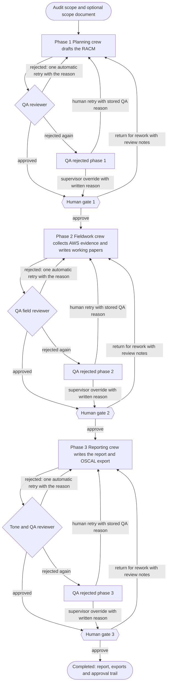

# Architecture

## How it works

The workflow runs three CrewAI crews in sequence. Each crew ends with a QA reviewer agent, and each phase ends at a human gate.

| Phase | Agents | Output |
|---|---|---|
| 1. Planning | Audit Director, Regulatory & Threat Analyst, Risk & Threat Specialist, Senior IT Auditor, Quality & Pushback Reviewer | RACM: 3-8 risks rated for likelihood and impact; per control its owner, frequency, nature, type, key-control flag, assertions / IT objectives and IPE (information produced by the entity: the reports and data the control relies on); test-of-design, test-of-effectiveness and substantive steps, plus population, sample size, sampling method and period of reliance |
| 2. Fieldwork | Field Evidence Collector (AWS tools), IT Field Auditor, Execution QA & Pushback Reviewer | Working papers: one finding per control, with separate test-of-design and operating-effectiveness conclusions (Effective / Exceptions noted / Ineffective / Not tested), exceptions, a result, a preliminary-deficiency flag, an exact evidence quote and a vault ID. "Not tested" when no evidence tool covers the control; a point-in-time configuration read counts as design evidence only |
| 3. Reporting | Audit Engagement Manager (deficiency evaluation), Lead Report Writer, Chief Audit Executive (executive summary), Reporting Tone & QA Reviewer, Compliance Documentation Engineer; 6 tasks, the writer also assembles the final report | A draft engagement-level deficiency evaluation (aggregation, compensating controls, likelihood x magnitude; control deficiency / significant deficiency / material weakness for SOX / ICFR scopes, otherwise Low / Medium / High) for the auditor to judge at Gate 3, the report narrative, executive summary, and (via a separate deterministic converter — see [OSCAL export](#oscal-export) below) an OSCAL Assessment Results document |

**What each phase receives.** The RACM drafter works from the Risk Specialist's ranked risk list. Fieldwork receives a compact per-control test plan from the approved RACM; the field auditor also sees the collector's raw tool output with vault IDs, and fieldwork QA checks the working papers against both. Reporting receives the scope, a summary of the RACM (risks and controls) and the approved working papers; the deficiency evaluation runs first and the writer, tone QA and final assembly work from it. `tests/test_prompt_inputs.py` checks that every placeholder in the crews' YAML prompts is filled by the inputs the flow passes.

**QA gates (automatic).** QA reviewers run at temperature 0. The other agents run at 0.1. If QA rejects the output, or its answer cannot be parsed, the phase counts as rejected: QA fails closed. The flow then re-runs the crew once with the rejection reason added to the drafting prompt. This happens in all three phases. A second rejection stops the phase in `QA_REJECTED_PHASE_n` and keeps the rejected draft for review. A crew error stops it in `ERROR_PHASE_n`.

**Deterministic evidence check (Fieldwork).** After the QA agent, every finding's quote is checked in code against the evidence vault record it cites; no model is involved. A finding with an empty quote passes only if it concludes the control was "Not tested". A quote that does not verify counts as a QA rejection whose reason lists the control IDs, so it goes through the same automatic retry and, if it fails again, stops in `QA_REJECTED_PHASE_2`. A supervisor can still override it with a written reason; the override records which controls were accepted unverified and a digest of the working papers it applies to. Approving Gate 2 re-runs the check and is refused (409) if a quote no longer verifies and was not accepted by an override of those exact working papers.

**QA independence (optional).** By default the QA reviewers use the same provider and model as the agents whose work they check, so they share its blind spots: a QA approval from the same model is not an independent review. `QA_LLM_MODEL` (with optional `QA_LLM_API_KEY` and `QA_LLM_BASE_URL`) gives the QA reviewers a different model through `get_qa_llm()` in `src/swarm/llm_factory.py`. A different model is still not a human reviewer.

**Human gates.** An explicit state machine (`src/swarm/state/machine.py`) decides which moves are allowed. Any other move raises `InvalidTransitionError`, which the API returns as HTTP 409 (for example, approving the same gate twice). At each gate a reviewer can:

- **Approve.** Gates 1 and 2 start the next phase. Gate 3 marks the audit `COMPLETED`. A gate with no artifact to approve is refused.
- **Return for rework** (`POST /api/sessions/{id}/return`) with required review notes. The phase re-runs, and the notes are passed to the crew the same way a QA rejection reason is.
- **Retry** a QA-rejected or failed phase. After a QA rejection, the stored rejection reason is passed back to the crew.
- **Approve despite the QA rejection** (supervisor override). This requires a written reason and does not skip anything: the phase moves to its normal human gate, which still has to be approved.

**Segregation of duties.** Every audit records who prepared it (`prepared_by`, required when the audit is created). The preparer cannot approve a gate, return work or override a QA rejection on that audit; the preparer may retry a phase. The Gate 3 (report) approver must be a different person from the Gate 2 (fieldwork) approver. Names are compared ignoring case and extra whitespace. The policy is in `src/swarm/review_policy.py`. These checks work on names as typed: the API has one shared token and cannot tell people apart, so they prevent accidental self-review and make it visible, but they do not stop someone who types another name. Audits created before `prepared_by` existed have no preparer, so only the Gate 2 / Gate 3 rule applies to them.

**Approval trail.** Each action is recorded with the gate, the reviewer's name as entered, a UTC timestamp, the action (`audit_created`, `gate_approval`, `return_for_rework`, `retry` or `qa_override`) and, where relevant, the notes, the override reason, the QA rejection it overrode and a SHA-256 digest of the artifact approved or accepted. Entries are only appended, and each one is hash-chained to the one before it (`prev_hash`, `entry_hash`); with `VAULT_ENCRYPTION_KEY` set the chain uses HMAC-SHA256 with a key derived from it for this purpose. `GET /api/sessions/{id}/trail/verify` (also shown in the session detail) recomputes the chain. It detects an edited entry, reordered entries, a removed entry other than the last one, and an approved artifact that changed after approval. With the key, it also detects an editor who recomputed every hash without the key. On its own it does not detect entries cut from the end of the trail — see [Security and data handling](SECURITY-AND-DATA.md) for the anchor file that helps with that. Trails from before chaining are reported as "unchained (legacy)".

**Generation provenance.** Each attempted phase run records the provider/model the drafting agents used, the QA model, both temperatures, the installed CrewAI and app versions, a fingerprint of the prompt files (and any active domain skill) in play, timestamps, attempts made, whether it was a demo run, and its outcome (`GET /api/sessions/{id}` as `generation_runs`). A gate approval, return, retry or override references the run it acted on, so the trail ties each review action to exactly what was reviewed. Evidence records also carry non-sensitive collection metadata (AWS region, the API operation called, the tool name, the app version, and — for the S3 tool — the caller's ARN with the account ID redacted), folded into the same integrity digest as the payload. None of this makes a run replayable: LLM output is not deterministic even from an identical provider, model, prompt and temperature. See DECISIONS.md ADR-010 for exactly what is and is not proven by this record.

**Deleting audits.** `DELETE /api/sessions/{id}` only deletes drafts. Once any gate has been approved or the audit is completed it returns 409, so signed-off work and its trail are kept.



**Evidence.** The Field Evidence Collector calls three boto3-based tools: IAM password policy, IAM users with MFA status, and S3 buckets with a PUBLIC / NOT_PUBLIC / UNKNOWN verdict per bucket (from the bucket policy status, ACL grants, and account- and bucket-level Block Public Access). A read that is denied makes the verdict UNKNOWN rather than a guess. Each result has AWS account IDs redacted and is written to the evidence vault, and the agent receives a vault ID with the output. The field auditor must quote evidence exactly. The UI checks each quote against the vault and shows "Quote verified in vault" or "Quote not verified".

**Outputs.** The UI shows the RACM, a findings board with per-finding vault checks, the report and the approval trail. Four downloads are available once the artifact exists (`GET /api/sessions/{id}/export/...`): `racm.xlsx`, `working-papers.xlsx`, `report.md` and `oscal.json`. Spreadsheet cells are sanitized against formula injection.

**Scope documents.** A new audit can include a PDF or text scope document (up to 5 MB, 30 PDF pages and 20,000 extracted characters). The extracted text is wrapped in delimiters that label it as untrusted user-supplied content. This reduces prompt-injection risk but does not remove it. The human gates are the control that matters.

## OSCAL export

`GET /api/sessions/{id}/export/oscal.json` is a real OSCAL 1.2.1 Assessment Results document, built by a deterministic converter (`src/swarm/oscal_ar.py`) from the gate-reviewed RACM, working papers, deficiency evaluation and approval trail — not the LLM's own `oscal_sar` output dumped as-is. It is validated in the pytest suite (`tests/test_oscal_ar.py`) against NIST's official OSCAL 1.2.1 assessment-results JSON schema (vendored in `tests/fixtures/oscal/`, see its README for source and license), and it was loaded once, by hand, in compliance-trestle 5.1.0 (trestle is not a project dependency). Audit-specific conclusions — test-of-design / test-of-effectiveness results and deficiency classification — are recorded as props under the project's own namespace, since OSCAL has no native field for them.

What it does not cover: there is no OSCAL assessment plan, system security plan, catalog or profile — control IDs are the engagement's own RACM IDs, not catalog IDs. Schema validation does not check OSCAL's Metaschema constraints or FedRAMP-specific rules; no external OSCAL validator runs in CI. See DECISIONS.md ADR-005 for the full mapping and limits.

## What I built vs what CrewAI provides

| CrewAI provides | This project adds |
|---|---|
| Agent, task and crew abstractions; sequential execution; LLM calls; parsing task output into Pydantic models | The audit state machine, three human gates, retry and supervisor-override actions, and the approval trail |
| | Fail-closed QA gates and the automatic retry that feeds the rejection reason back, in every phase |
| | The evidence vault: account-ID redaction, SHA-256 or keyed HMAC digests, optional encryption, exact-quote verification, and a digest migration command |
| | Read-only AWS evidence tools (boto3) and the matching minimal IAM policy |
| | Audit schemas: RACM with design/effectiveness/substantive steps, working papers, and the OSCAL Assessment Results export |
| | Generation provenance: recorded model/prompt versions per run, linked from the approval trail |
| | Prompt wiring between phases (ranked risks, RACM, working papers, findings index) and the tests that check it |
| | FastAPI backend, React UI, exports, scope-document handling and DEMO_MODE |
| | The test suite, CI, container setup and security tooling |

## Project structure

```
src/
  swarm/
    audit_flow.py        # AuditFlow: runs the phases, QA retry, gates, approval trail, provenance
    state/
      machine.py         # AuditStateMachine: allowed transitions, InvalidTransitionError
      schema.py          # AuditState, GenerationRun
      repository.py      # Save / load a flow with its artifacts
    crews/               # PlanningCrew, FieldworkCrew, ReportingCrew, result adapter
    config/              # YAML agent and task prompts per crew; MCP server config
    tools/
      aws_checks.py      # Read-only boto3 evidence logic (shared with the MCP server)
      aws_tools.py       # CrewAI tool wrappers: redaction and vault registration
    evidence.py          # Evidence vault, redaction, quote check, migrate-digests
    schema.py            # RACM, working paper, final report and LLM-drafted oscal_sar models
    oscal_ar.py           # Deterministic converter: gate-reviewed artifacts -> OSCAL 1.2.1 Assessment Results
    demo.py              # DEMO_MODE stand-in crews and labeled demo artifacts
    llm_factory.py       # LLM provider selection
    mcp_server.py        # Standalone MCP server exposing the AWS reads (no redaction or vault)
    session_manager.py   # Session file persistence
    skill_loader.py      # Loads domain skill prompts from skills/
  api/
    main.py              # FastAPI app, auth, CORS, upload size limit
    auth.py              # Bearer-token check
    executor.py          # Thread pool for phase jobs
    job_store.py         # Job status tracking
    models.py            # Request/response models
    routers/             # sessions (gates, retry, override), exports, phases (jobs, stream), evidence, config
    exports.py           # xlsx / Markdown / OSCAL JSON builders with formula-injection sanitizing
    scope_document.py    # PDF and text scope-document extraction and wrapping
frontend/                # React + Vite UI, served by nginx in Compose (nginx.conf.template)
skills/                  # Domain skill prompts (AWS, ITGC, PCI DSS, HIPAA, GDPR)
tests/                   # pytest suite; tests/eval/ holds the moto evidence-layer evaluation;
                         # tests/fixtures/oscal/ vendors the NIST OSCAL 1.2.1 schema
evals/                   # LLM-layer evaluation: scenarios, draft answer key, runner, metrics, replay fixtures
run_monitor.py           # Headless run of all three crews
aws_safety_heartbeat.py  # Checks a lab AWS account for running EC2 / RDS resources
Dockerfile, docker-compose.yml
```

## Testing and CI

```bash
uv sync
PYTHONPATH=. uv run pytest tests/ -q --cov=src   # unit and API tests with coverage
uv run pre-commit run --all-files                  # ruff, bandit, detect-secrets, pip-audit, hygiene
uv run pyright src/                                # type check
cd frontend && npm ci && npm run lint && npm run build

# Headless run of the real crews, without the API or UI (needs an LLM provider)
uv run python run_monitor.py                 # all three phases
uv run python run_monitor.py --phase1-only   # Planning only
uv run python run_monitor.py --skip-aws      # mock working papers instead of the Fieldwork crew
```

The tests use mocked crews, LLMs and AWS clients (MagicMock, botocore Stubber, and moto for the evidence-layer evaluation in `tests/eval/`). They cover the state machine and gates, QA fail-closed behavior and retries, prompt wiring, the evidence vault and redaction, the AWS tools, the LLM factory, session persistence, the OSCAL export against the vendored NIST schema, generation provenance, and the API (gates, retry and override, exports, scope upload, DEMO_MODE, and a 404 for streaming an unknown session's event stream, which also fixes unbounded queue growth for ids nobody created). At the time of writing: 714 Python tests (95% line coverage of `src/`), including the offline LLM-evaluation harness tests, and 21 frontend tests (Vitest and React Testing Library).

### Evidence-layer evaluation

`tests/eval/` checks the deterministic evidence collection against planted misconfigurations. Each scenario seeds a fresh in-memory AWS account ([moto](https://github.com/getmoto/moto)) with a known configuration, runs the real CrewAI evidence tool, and checks three things: the evidence matches what was planted, the output contains no account ID, and the output is in the evidence vault with an exact quote that verifies.

```bash
PYTHONPATH=. uv run pytest tests/eval -v      # add -s to print the scenario scorecard
```

| Scenario | Expected evidence |
|---|---|
| No account password policy | Finding: no policy set |
| Weak policy (length 6, no symbols) / strong policy (length 14, all character types, rotation, reuse) | Policy values reported exactly |
| 60 IAM users, every third with a virtual MFA device | Yes / No per user |
| Private bucket; bucket policy granting only the owner account | NOT_PUBLIC |
| ACL grant to AllUsers (READ; READ and WRITE) | PUBLIC, with each grant as a reason |
| ACL grant to AuthenticatedUsers (any AWS account) | PUBLIC |
| Bucket policy with `Principal: "*"` | PUBLIC |
| Public policy, bucket-level RestrictPublicBuckets on | NOT_PUBLIC, with a note |
| Public ACL, account-level IgnorePublicAcls on | NOT_PUBLIC, with a note |
| Public ACL, all four bucket-level BPA flags on | NOT_PUBLIC |
| Public ACL, only BlockPublicAcls on (blocks new ACLs, not existing ones) | PUBLIC |
| Partial bucket-level BPA, nothing public | NOT_PUBLIC (the old check flagged this) |
| Account ID inside a bucket name | Redacted in output and vault |

moto does not implement everything faithfully. `GetBucketPolicyStatus` returns no `IsPublic` value, moto accepts public ACLs and policies that Block Public Access would reject, it returns only one grant for the `public-read-write` canned ACL, and it does not paginate `ListUsers`. The test module lists how each gap is handled, and `tests/test_aws_checks.py` covers those branches (policy status, access denied on each read, pagination markers) with botocore Stubber against the real AWS API models. For policy scenarios, the scenario states the `IsPublic` value AWS returns for the planted policy, so those rows test how the tool combines that value with the ACL and Block Public Access, not AWS's policy evaluation.

This does not evaluate the LLM agents; the LLM-layer harness in [docs/EVALUATION.md](EVALUATION.md) does.

CI (`.github/workflows/ci.yml`) runs on every push and pull request to `master`:

- pre-commit hooks (ruff lint and format, bandit, detect-secrets, pip-audit, file hygiene);
- pyright on `src/`;
- pytest on Python 3.11, 3.12 and 3.13, failing below 50% coverage;
- bandit, and pip-audit against the exported `uv.lock` requirements (the ignored advisories are listed and explained in the workflow);
- frontend lint, build and `npm audit --audit-level=high`;
- Docker builds for both images and `docker compose config`. The API image runs Python 3.13, the newest version the test matrix covers.

All GitHub Actions are pinned to commit SHAs. A dependency-review workflow runs on pull requests, and Dependabot tracks uv, npm, GitHub Actions and both Dockerfiles. Python 3.14 is not supported yet: crewai pins `chromadb~=1.1.0`, and chromadb 1.1.x fails to import on 3.14, so Dependabot is told not to propose it.

See [docs/EVALUATION.md](EVALUATION.md) for the evidence-layer and LLM-layer evaluation harnesses.
